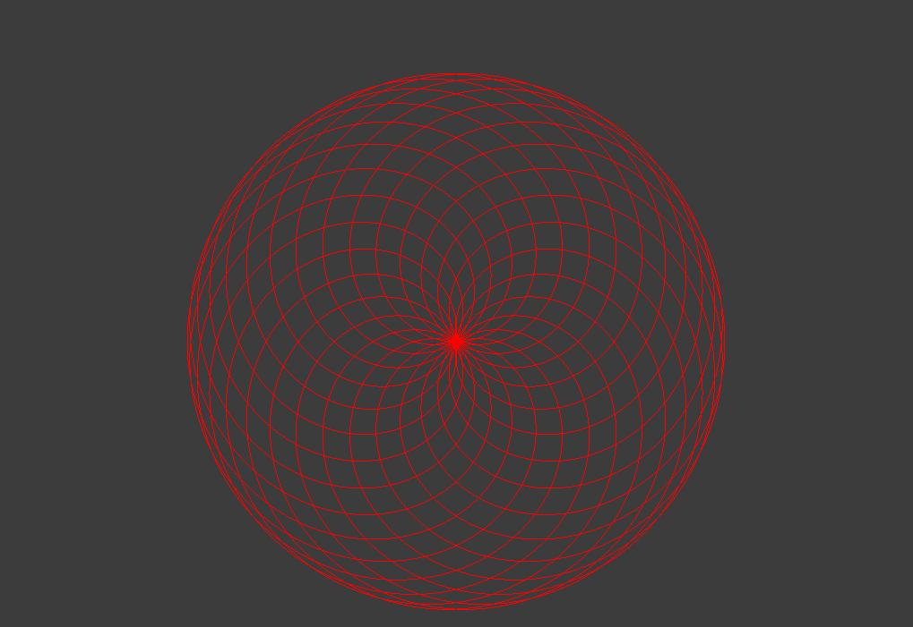
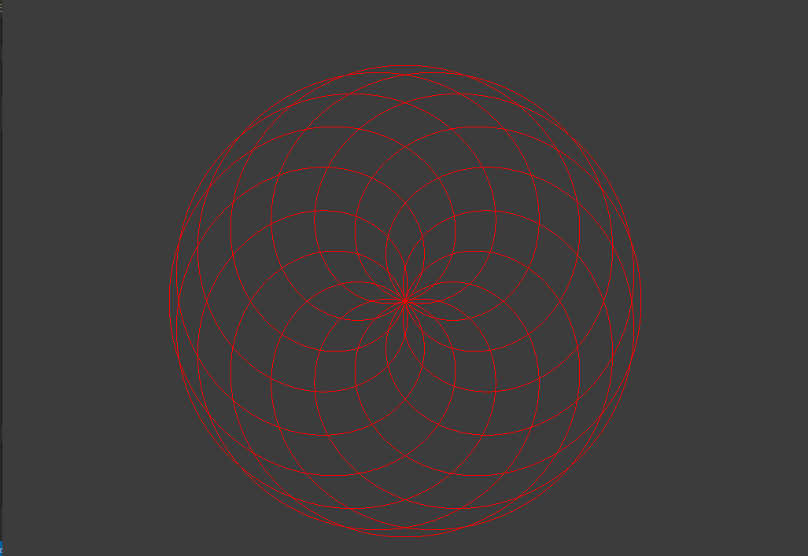
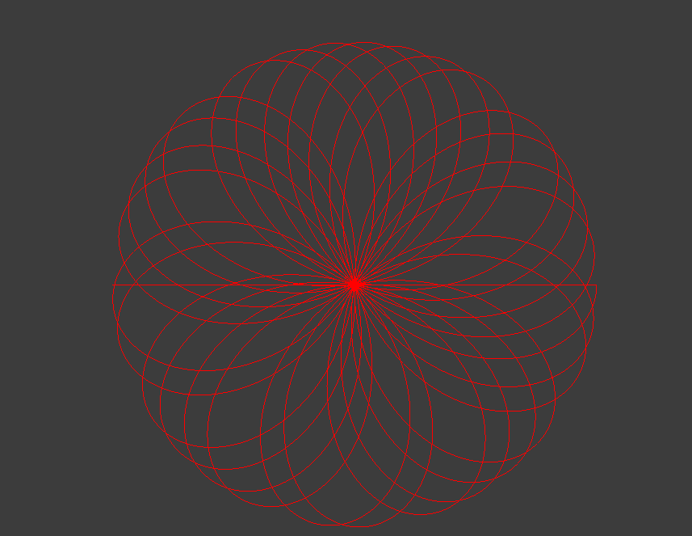

 # Week 2 - Open Frameworks
 
 This is simply a reimplimentation of my favorite mathematical shape, the Rhodonea Curve. The polar rose!

 The structure for C++ projects with a header file and code file seems unneccesarily divided. I kept trying to initialize and use code, completely forgetting the presence of the header file. While the Arduino code is based on C++, it isn't the same. This project made that clear.

 Forgetting to use the header file aside, the rose is far easier to implement in OpenFrameworks than it is on canvas using JS. Perhaps that isn't surprising, considering OF is a graphical library.

I didn't find a straightforward way to add interaction in the form of user input to choose what numerator and denominator to use in the classic rose equation k = numerator / denominator. Instead, I made a simple increment/decrement iteration series. The rose will iterate numerator up to 20, and denominator up to 40. There are all kinds of cool shapes in this range, such as the included images.

 Installing on Linux was something of a pain, since OF's dependency installation script is WRONG for Ubuntu. I had to edit install_dependencies.sh to install the correct package. The CLI Project Generator also doesn't seem to work as intended, but the graphical one works just fine.

 Key when compiling on Linux: `make && make RunRelease`